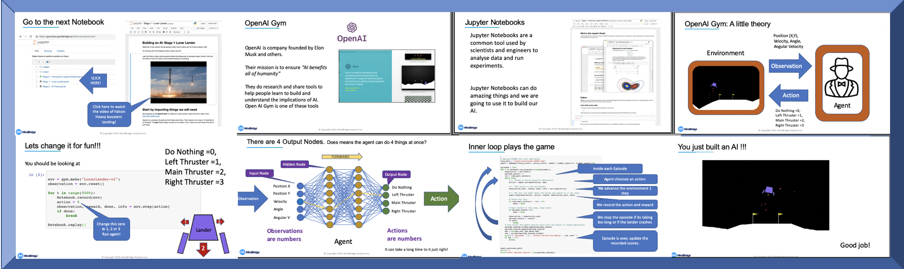

# Lunar Lander Workshop

This repo contains an education workshop developed to allow students to build an understanding of reinforced learning. In the workshop the students learn aspects of machine learning required to land a lunar lander which is part of the OpenAI Gym environment. Step by step they can build an AI and see it working. The workshop takes around 2 hours and is intended to be run on Chromebooks. 

In addition there is a particular focus on how to measure the 'fitness' of the resulting AI. 


## Local Installation

### Jupyter Notebook - Local Machine Ubuntu Linux 18.04 (Not Chromebook)

Install Python3, Pip3, iPython3 and Python3 Tkinter

```sh
sudo apt install python3-pip python3-dev ipython3 python3-tk
```

Install OpenAI Gym Pre-req

```sh
sudo apt-get install -y zlib1g-dev libjpeg-dev cmake swig python-pyglet python3-opengl libboost-all-dev libsdl2-dev libosmesa6-dev patchelf ffmpeg xvfb
```


Now add to your `.bashrc` file

```sh
export PATH=$PATH:~/.local/bin/
```

Install Jupyter

```sh
pip3 install jupyter
```

Install OpenAI Gym itself, and some default environments and the notebook requirements

```sh
pip3 install gym 'gym[box2d]' 'gym[atari]' 'gym[classic_control]' numpy torch matplotlib JSAnimation tensorflow ipywidgets
```


Enable progress bar extensions

```sh
jupyter nbextension enable --py widgetsnbextension
```

## Server Installation
### JupyterHub - Remote Server Ubuntu Linux 18.04 (Chromebook/WebBrowser)
Follow these steps to install on a remotely hostly machine 

Install Python3, Pip3, iPython3, Python3 Tkinter, 

```sh
sudo apt install python3-pip python3-dev ipython3 python3-tk
```

Install OpenAI Gym Pre-req

```sh
sudo apt-get install -y zlib1g-dev libjpeg-dev cmake swig python-pyglet python3-opengl libboost-all-dev libsdl2-dev libosmesa6-dev patchelf ffmpeg xvfb
```


Now install NPM, NodeJS

```sh
sudo apt install nodejs
```

```sh
sudo apt install npm
```

Run all the following as root ```sudo su```

Install JupyterHub

```sh
python3 -m pip install jupyterhub
```

Install HTTP Proxy

```sh
sudo npm install -g configurable-http-proxy
```

Install Notebook

```sh
python3 -m pip install notebook
```

Install the OpenAI Gym stuff and our notebook dependancies

```sh
pip3 install gym 'gym[box2d]' 'gym[atari]' 'gym[classic_control]' numpy torch matplotlib JSAnimation tensorflow ipywidgets
```

Now add to your `.bashrc` file

```sh
export PATH=$PATH:~/.local/bin/
```


Follow your install specific needs to setup your server. Refer to the followig URL for all the options.  

https://jupyterhub.readthedocs.io/en/latest/getting-started/index.html

Hints: 

* Get an SSL certificate for your install
* Create a configuration file called  jupyterhub_config.py 
* Set your certificate details and any login details in the config file (lots of options) 
* If your server has no physical video card or screen, like say you are running in the cloud, then you need to use *xvfb* when you spawn new notebeook servers
* Create user accounts
* Enjoy!


## Running with xvfb on a cloud server. 

Create a file called xvfb-jupyterhub-singleuser, edit
```sh
touch ~/.local/bin/xvfb-jupyterhub-singleuser
nano ~/.local/bin/xvfb-jupyterhub-singleuser
```

Add the following code to the file 

```bash
#!/bin/bash
xvfb-run -a jupyterhub-singleuser $1
```

Now make it executable

```sh
chmod +x ~/.local/bin/xvfb-jupyterhub-singleuser
```

Now edit *jupyterhub_config.py* and change the Spawner command for jupyterhub-singleuser to xvfb-jupyterhub-singleuser

```python
c.Spawner.cmd = ['xvfb-jupyterhub-singleuser']
```
## Making jupyterhub start at system start

Read and do this. 
https://github.com/jupyterhub/jupyterhub/wiki/Run-jupyterhub-as-a-system-service#ubuntudebian-anaconda3-with-systemd

Then 
```sh
sudo systemctl enable jupyterhub
```
